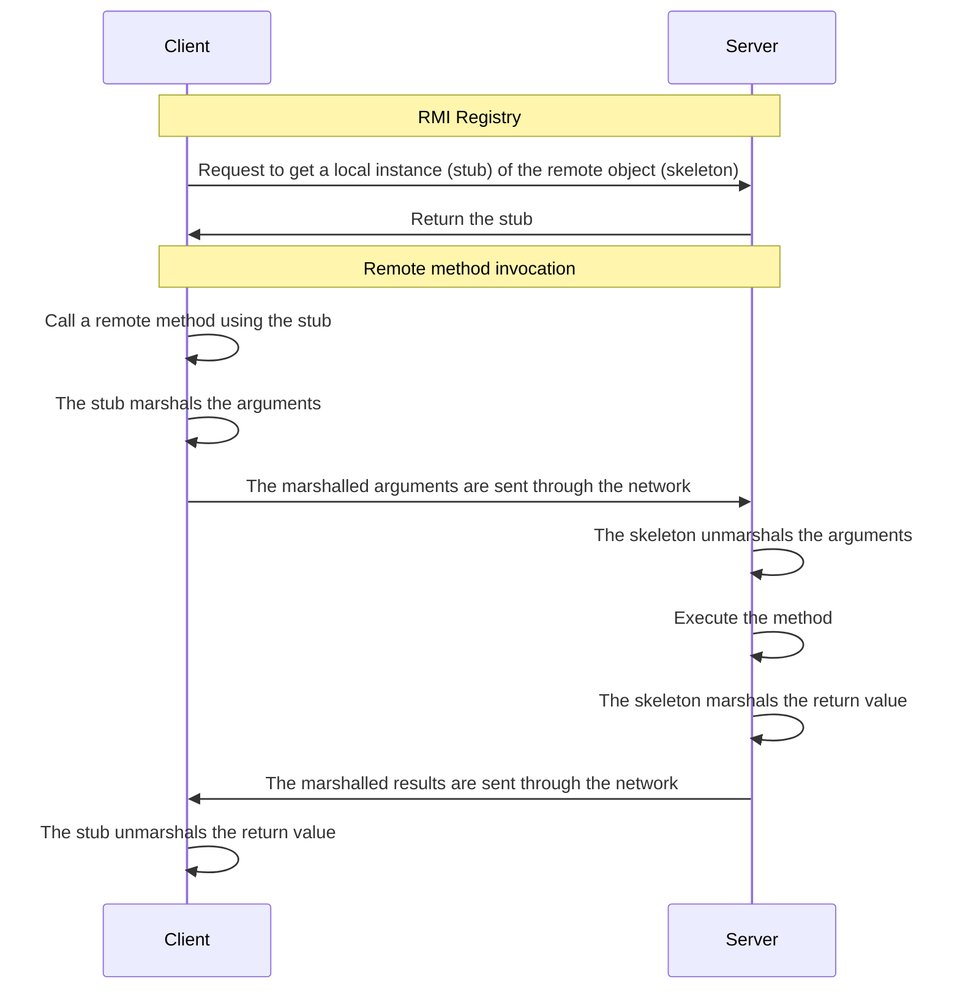

# Sequence diagram

## References

1. [Distributed Objects and Java RMI basics](http://si.deis.unical.it/~talia/aa0304/dis/es1-1p.pdf)
2. [Oracle | An Overview of RMI Applications](https://docs.oracle.com/javase/tutorial/rmi/overview.html)