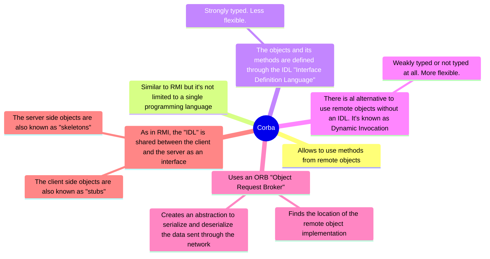

```mermaid
mindmap
  root((Corba))
    Allows to use methods from remote objects

    Similar to RMI but it's not limited to a single programming language

    The objects and its methods are defined through the IDL "Interface Definition Language"
        Strongly typed. Less flexible.

    There is al alternative to use remote objects without an IDL. It's known as Dynamic Invocation
        Weakly typed or not typed at all. More flexible.

    Uses an ORB "Object Request Broker"
        Finds the location of the remote object implementation
        Creates an abstraction to serialize and deserialize the data sent through the network

    As in RMI, the "IDL" is shared between the client and the server as an interface
        The client side objects are also known as "stubs"
        The server side objects are also known as "skeletons"
```