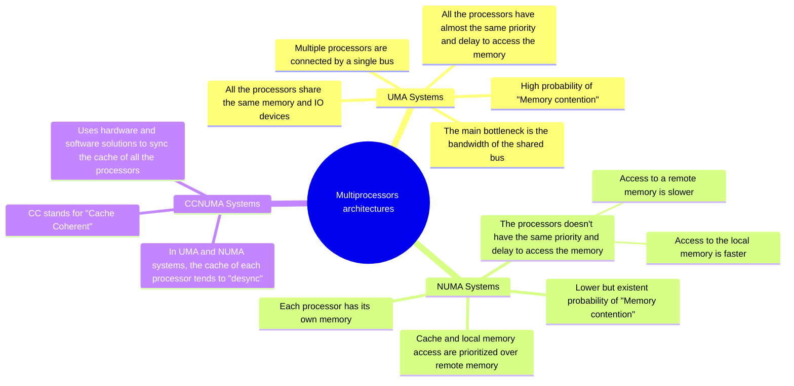

```mermaid
mindmap
  root((Multiprocessors architectures))
    UMA Systems
        Multiple processors are connected by a single bus
        All the processors share the same memory and IO devices
        All the processors have almost the same priority and delay to access the memory
        The main bottleneck is the bandwidth of the shared bus
        High probability of "Memory contention"

    NUMA Systems
        Each processor has its own memory
        The processors doesn't have the same priority and delay to access the memory
            Access to the local memory is faster
            Access to a remote memory is slower
        Cache and local memory access are prioritized over remote memory
        Lower but existent probability of "Memory contention"

    CCNUMA Systems
        CC stands for "Cache Coherent"
        In UMA and NUMA systems, the cache of each processor tends to "desync"
        Uses hardware and software solutions to sync the cache of all the processors
```