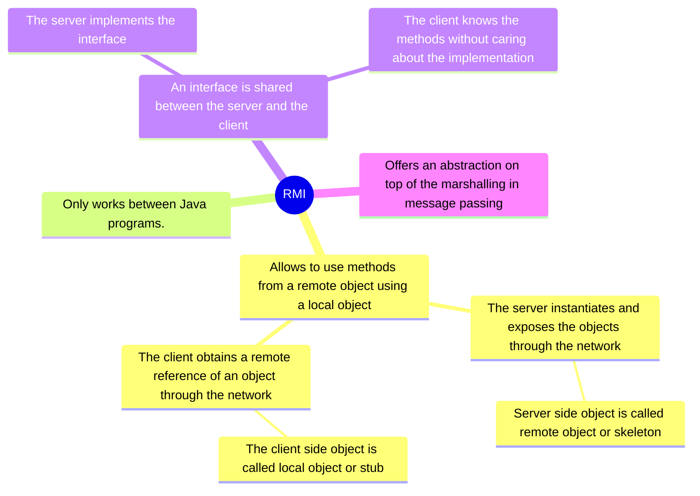

```mermaid
mindmap
  root((RMI))
    Allows to use methods from a remote object using a local object
        The server instantiates and exposes the objects through the network
            Server side object is called remote object or skeleton
        The client obtains a remote reference of an object through the network
            The client side object is called local object or stub

    Only works between Java programs.

    An interface is shared between the server and the client
        The server implements the interface
        The client knows the methods without caring about the implementation

    Offers an abstraction on top of the marshalling in message passing
```
