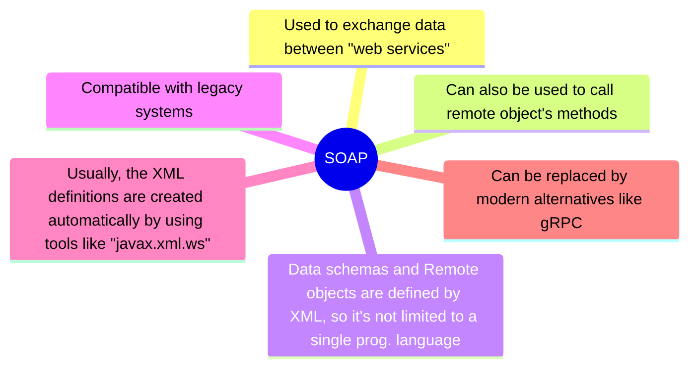

```mermaid
mindmap
  root((SOAP))
    Used to exchange data between "web services"

   Can also be used to call remote object's methods

   Data schemas and Remote objects are defined by XML, so it's not limited to a single prog. language

   Compatible with legacy systems

   Usually, the XML definitions are created automatically by using tools like "javax.xml.ws"

   Can be replaced by modern alternatives like gRPC
```
