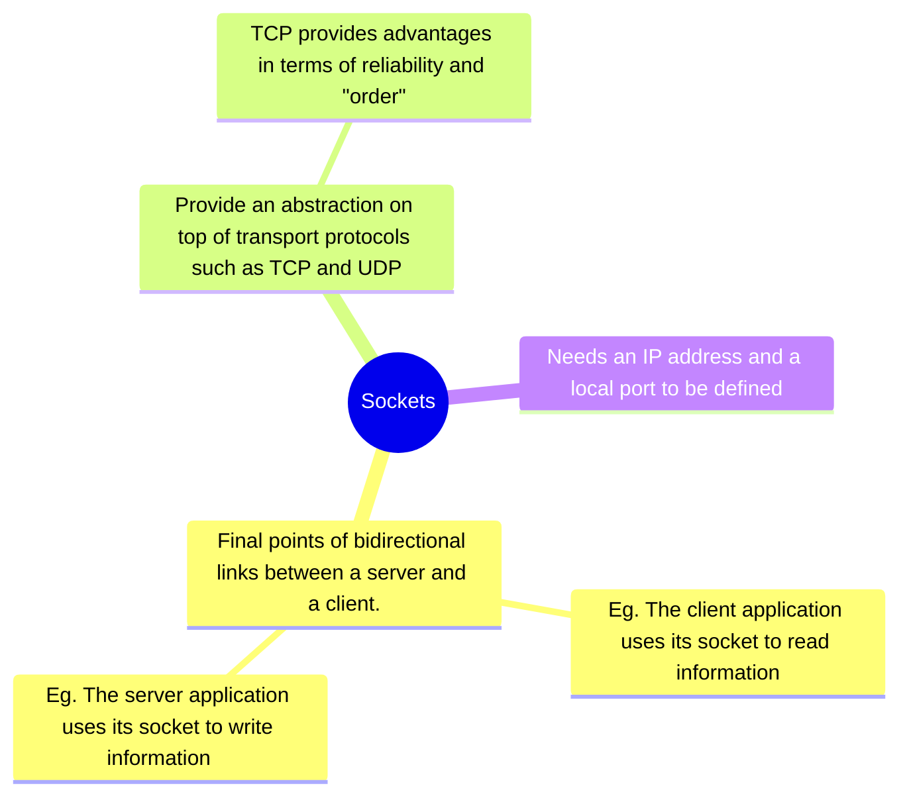

```mermaid
mindmap
  root((Sockets))
    Final points of bidirectional links between a server and a client.
        Eg. The client application uses its socket to read information
        Eg. The server application uses its socket to write information    
    
    Provide an abstraction on top of transport protocols such as TCP and UDP
        TCP provides advantages in terms of reliability and "order"

    Needs an IP address and a local port to be defined
```