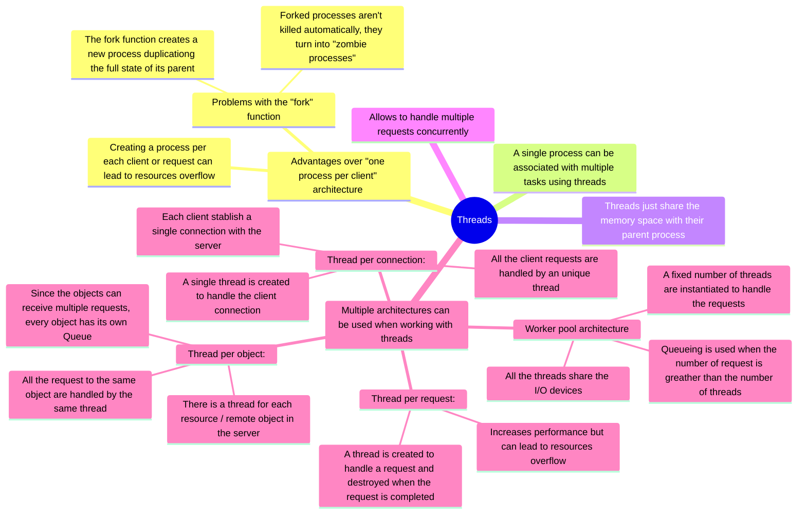

```mermaid
mindmap
  root((Threads))
    Advantages over "one process per client" architecture 
        Creating a process per each client or request can lead to resources overflow
        Problems with the "fork" function
            The fork function creates a new process duplicationg the full state of its parent
            Forked processes aren't killed automatically, they turn into "zombie processes"

    A single process can be associated with multiple tasks using threads
    
    Threads just share the memory space with their parent process

    Allows to handle multiple requests concurrently

    Multiple architectures can be used when working with threads
        Worker pool architecture
            A fixed number of threads are instantiated to handle the requests
            Queueing is used when the number of request is greather than the number of threads
            All the threads share the I/O devices
        
        Thread per request: 
            A thread is created to handle a request and destroyed when the request is completed
            Increases performance but can lead to resources overflow
        
        Thread per connection: 
            Each client stablish a single connection with the server
            A single thread is created to handle the client connection
            All the client requests are handled by an unique thread

        Thread per object:  
            There is a thread for each resource / remote object in the server
            All the request to the same object are handled by the same thread
            Since the objects can receive multiple requests, every object has its own Queue
```